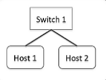
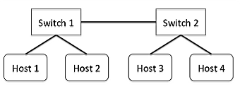
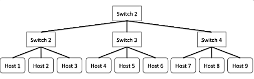

# Internet Engineering Assignment #5 - MiniNet and Multipath TCP

## Prerequisite
- Read instructions in [here](https://github.com/qdeconinck/sigcomm20_mptp_tutorial) and follow the steps

## Creating different toplogies with MiniNet

### A

<p align="center">
  
</p>

This is the `minimal` topology and we can create this in one of two ways:
-	`minimal` topology

```bash
$ sudo mn --topo minimal
```

`net` command's output:

```bash
mininet> net
h1 h1-eth0:s1-eth1
h2 h2-eth0:s1-eth2
s1 lo:  s1-eth1:h1-eth0 s1-eth2:h2-eth0
c0
```

- `single` toplogy using 2 hosts

```bash
$ sudo mn --topo signle,2
```

`net` command's output

```bash
mininet> net
h1 h1-eth0:s1-eth1
h2 h2-eth0:s1-eth2
s1 lo:  s1-eth1:h1-eth0 s1-eth2:h2-eth0
c0
```

### B

<p align="center">
  
</p>

This topology can be craete with `linear`, so:

```bash
$ sudo mn --topo linear,2,2
```

The above command will create 2 siwtch with 2 hosts each.

`net` command's output:

```bash
mininet> net
h1s1 h1s1-eth0:s1-eth1
h1s2 h1s2-eth0:s2-eth1
h2s1 h2s1-eth0:s1-eth2
h2s2 h2s2-eth0:s2-eth2
s1 lo:  s1-eth1:h1s1-eth0 s1-eth2:h2s1-eth0 s1-eth3:s2-eth3
s2 lo:  s2-eth1:h1s2-eth0 s2-eth2:h2s2-eth0 s2-eth3:s1-eth3
c0
```

### C

<p align="center">
  
</p>

This is the `tree` topology and can be created as follows:

```bash
$ sudo mn --topo tree,2,3
# or you specify what each number means like below
$ sudo mn --topo,depth=2,fanout=3
```

`net` command's output:

```bash
mininet> net
h1 h1-eth0:s2-eth1
h2 h2-eth0:s2-eth2
h3 h3-eth0:s2-eth3
h4 h4-eth0:s3-eth1
h5 h5-eth0:s3-eth2
h6 h6-eth0:s3-eth3
h7 h7-eth0:s4-eth1
h8 h8-eth0:s4-eth2
h9 h9-eth0:s4-eth3
s1 lo:  s1-eth1:s2-eth4 s1-eth2:s3-eth4 s1-eth3:s4-eth4
s2 lo:  s2-eth1:h1-eth0 s2-eth2:h2-eth0 s2-eth3:h3-eth0 s2-eth4:s1-eth1
s3 lo:  s3-eth1:h4-eth0 s3-eth2:h5-eth0 s3-eth3:h6-eth0 s3-eth4:s1-eth2
s4 lo:  s4-eth1:h7-eth0 s4-eth2:h8-eth0 s4-eth3:h9-eth0 s4-eth4:s1-eth3
c0
```

## Working with Latency and Bandwidth
